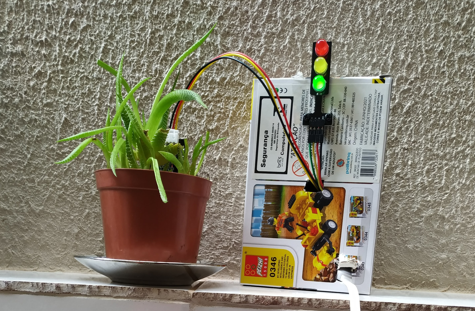

# Monitoramento Umidade 🪴💧

Criei esse projeto para monitorar a umidade do solo da minha plantinha para saber quando ela está precisando de água.

# Hardware
* NodeMCU ESP8266
* Modulo Semáforo
* Sensor Capacitivo de Umidade do Solo

# Execução

Ainda falta eu colocar certinho o esquema de ligação que fiz na minha plaquinha, mas basicamente é comprar os itens acima, abrir a IDE do Arduino, subir o código que está aqui no repositório e VRAU, o semaforo irá mudar de acordo com a umidade do solo, sendo verde bem umido, amarelo está começando a secar e vermelho está seco.

# Final

